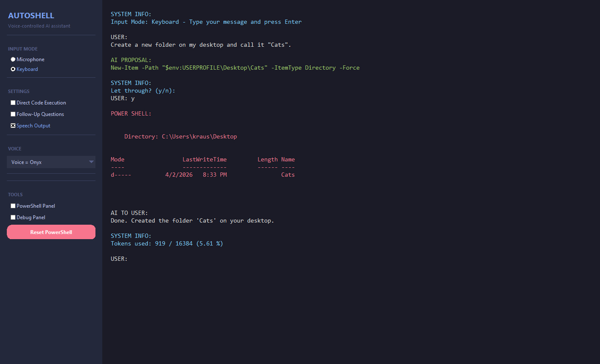

# Autoshell

**Autoshell** is a voice-controlled AI assistant for Windows PowerShell. Speak or type a command, and the AI either answers you directly (with speech synthesis) or executes the appropriate PowerShell command on your behalf — providing a nearly hands-free way to control your PC.



---

## Features

- **Voice & keyboard input** — switch between microphone and keyboard at any time
- **AI-powered PowerShell control** — the assistant generates and executes shell commands for you
- **Confirmation gate** — optionally review AI-proposed commands before they run
- **Speech output** — responses are spoken aloud using OpenAI's TTS (6 voice options)
- **Follow-up questions** — the AI can ask clarifying questions before acting
- **Live PowerShell panel** — see shell output directly in the GUI
- **Token usage tracking** — context usage is shown after each response

### Example capabilities

- Open applications
- Query PC specs (battery, hardware, network, etc.)
- Create, move, and delete files and folders
- Shut down, restart, lock, or log off the PC
- Write and run small scripts
- General conversation in multiple languages

---

## Requirements

- Windows (PowerShell required)
- Python 3.10+
- An [OpenAI API key](https://platform.openai.com/api-keys) stored in the environment variable `OPENAI_API_KEY`
- An internet connection (all AI models are cloud-based)

> **Cost notice:** Each request calls the OpenAI API, which incurs usage fees. Your input is sent to OpenAI's servers.

---

## Setup

```bash
# Clone the repository
git clone https://github.com/gregor2018github/ProjectAutoshell.git
cd ProjectAutoshell

# Create and activate a virtual environment
python -m venv autoshell_envi
source autoshell_envi/Scripts/activate  # Windows Git Bash / bash
# or: autoshell_envi\Scripts\activate   # Windows CMD

# Install dependencies
pip install -r requirements.txt

# Set your OpenAI API key
export OPENAI_API_KEY="sk-..."
```

---

## Running

```bash
source autoshell_envi/Scripts/activate
python Autoshell.py
```

---

## GUI Overview

| Panel | Description |
|---|---|
| **Input Mode** | Toggle between Microphone and Keyboard input |
| **Settings** | Enable/disable Direct Code Execution, Follow-Up Questions, and Speech Output |
| **Voice** | Select from 6 TTS voices (Alloy, Echo, Fable, Nova, Onyx, Shimmer) |
| **Tools** | Show/hide the PowerShell panel and Debug panel |
| **Reset PowerShell** | Restart the PowerShell subprocess if it becomes unresponsive |

The main area shows a color-coded conversation log:
- **White** — user messages and AI responses
- **Green** — AI-proposed shell commands (pending confirmation)
- **Red** — PowerShell output

---

## File Structure

```
ProjectAutoshell/
├── Autoshell.py                  # Main application
├── requirements.txt              # Python dependencies
├── files/
│   ├── pre_prompt_shell.txt      # System prompt for the AI assistant
│   ├── pre_prompt_forwarder.txt  # System prompt for the routing classifier
│   ├── audio_dummy.wav           # Silent audio placeholder
│   ├── example_*.mp3             # Voice preview samples (6 voices)
│   ├── icon.ico                  # Application icon
│   └── screenshot.jpg            # GUI screenshot
└── logs/                         # Auto-generated chat and command history
```

---

## Architecture

The application is a single Python file with five classes:

- **GuiHandler** — Tkinter GUI, controls, and layout
- **SoundHandler** — PyAudio recording, Whisper speech-to-text, OpenAI TTS playback
- **ShellHandler** — Spawns and manages a persistent PowerShell subprocess
- **OpenAiHandler** — Wrapper around OpenAI chat completions
- **PromptHandler** — Chat history management and response routing logic

After each AI response, a lightweight second API call classifies the response as `user` (display + speak), `shell` (execute in PowerShell), or `empty` (no action).

---

## AI Models Used

| Purpose | Model |
|---|---|
| Text generation & conversation | GPT (configurable via `LARGE_LANGUAGE_MODEL`) |
| Speech-to-text | Whisper (`whisper-1`) |
| Text-to-speech | OpenAI TTS (`tts-1`) |

The prompts driving the AI's behavior are in `files/pre_prompt_shell.txt` and `files/pre_prompt_forwarder.txt` — edit them to customize how the assistant behaves.
